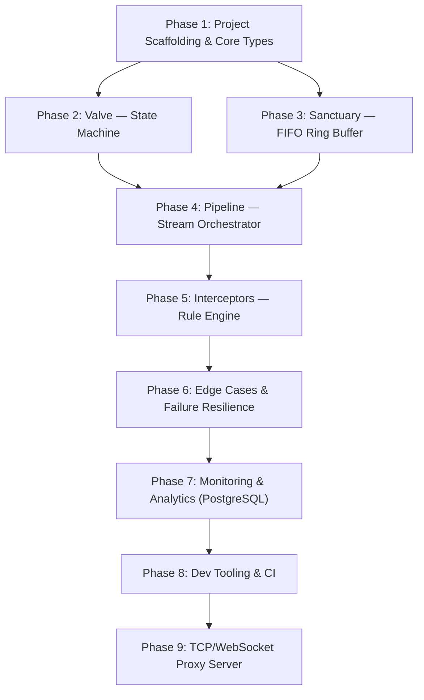
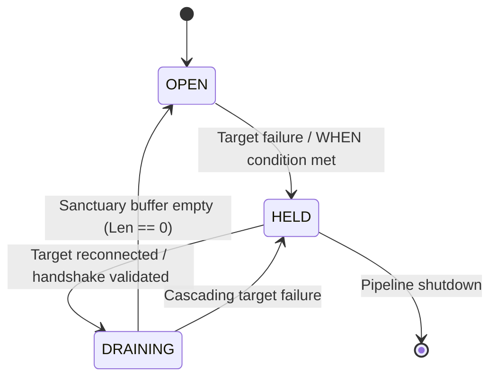
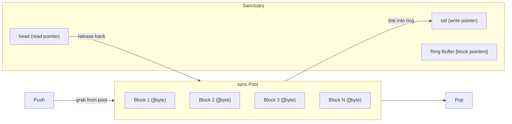
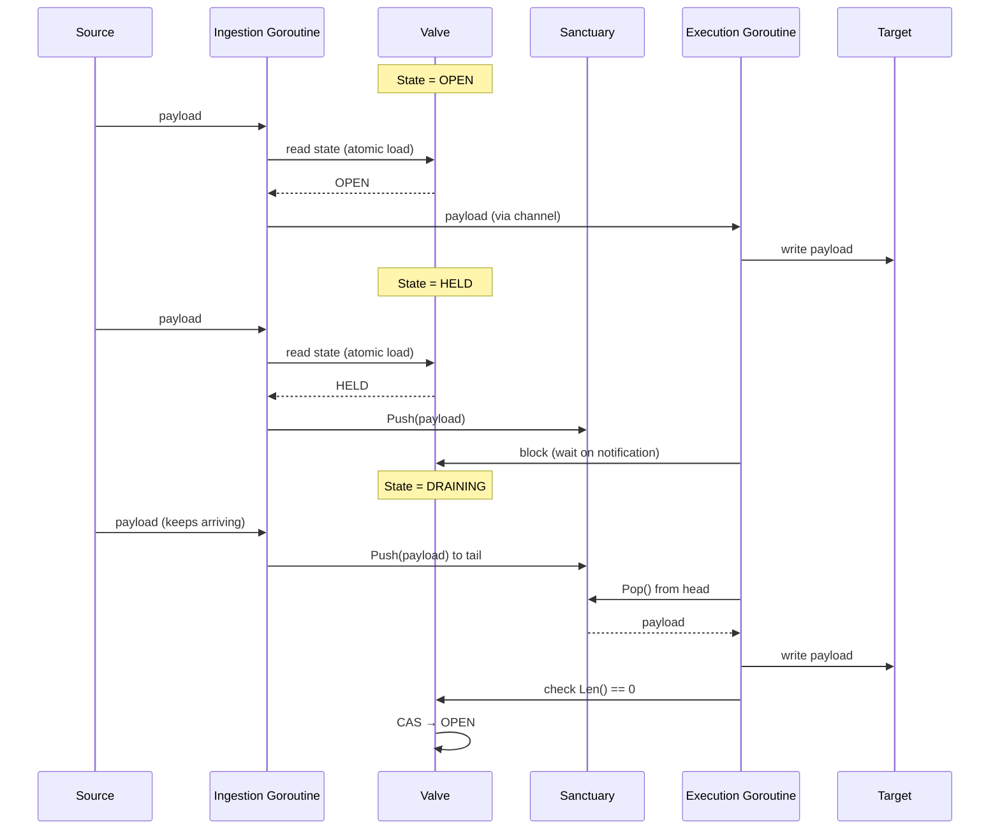
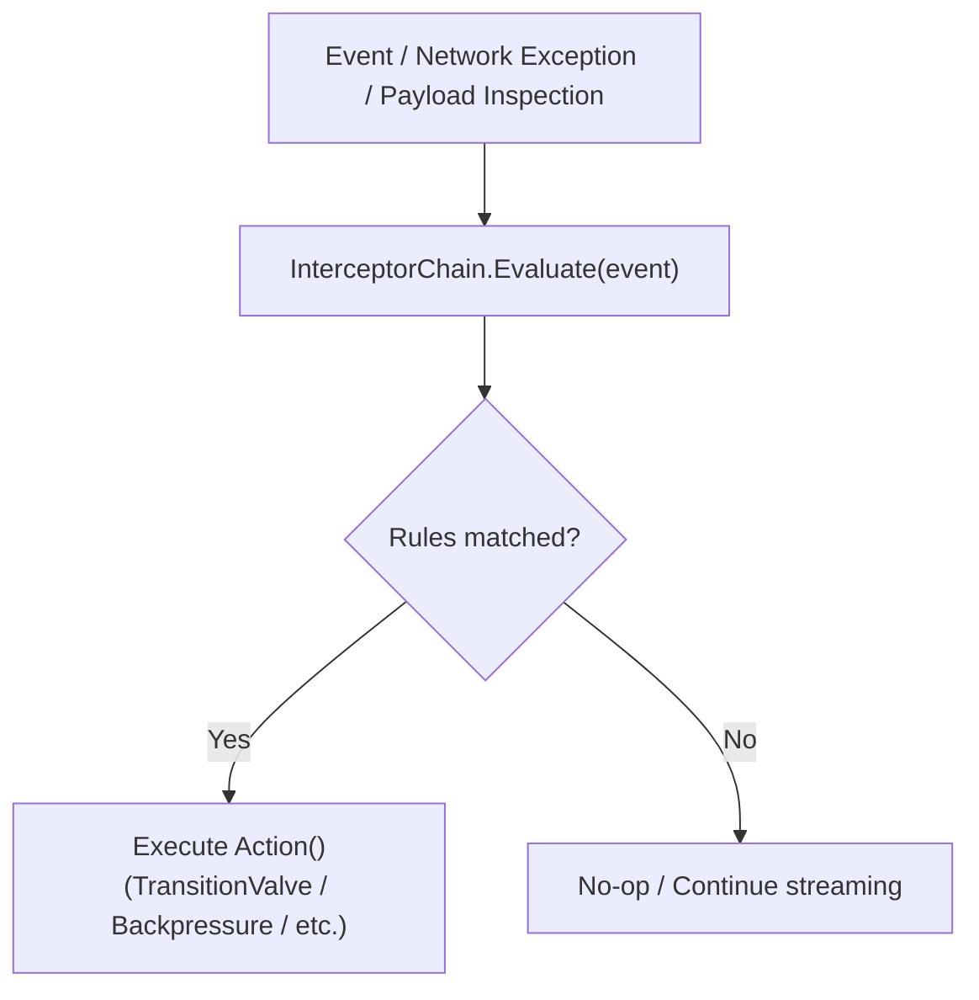
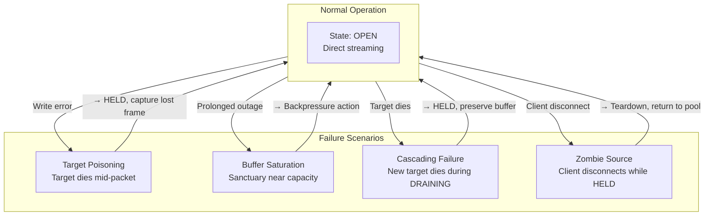
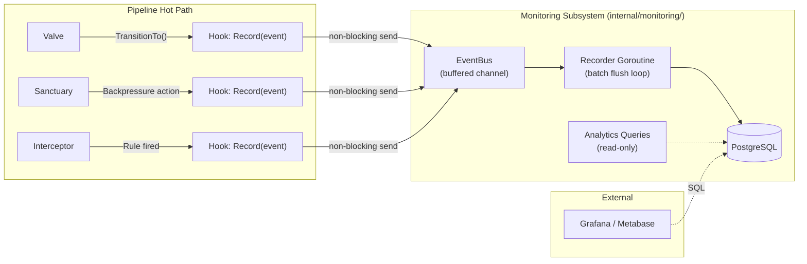
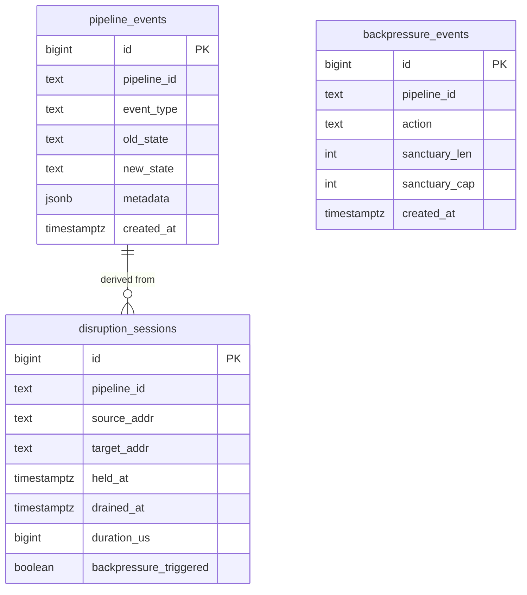
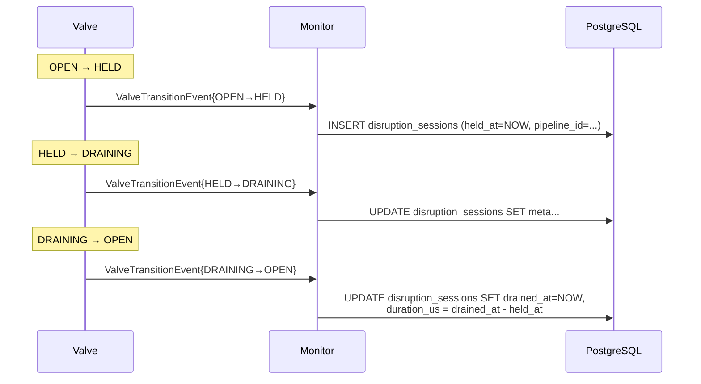
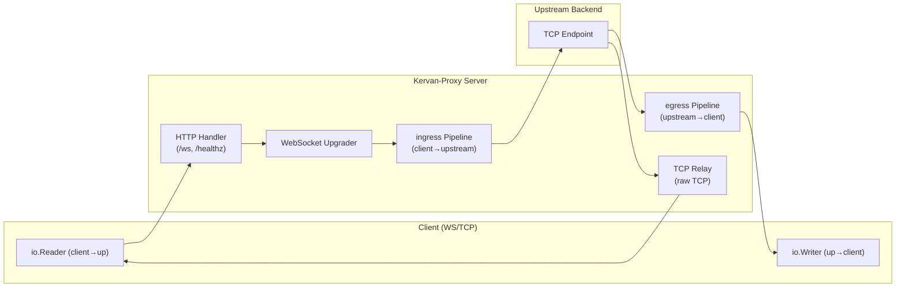

# Kervan-Proxy — Implementation Plan

## Overview

Kervan-Proxy is a zero-dependency, protocol-agnostic L7 proxy and circuit-buffering engine in Go. It shields upstream backends by buffering payloads during outages and replaying them in FIFO order once the target recovers.

### Core Primitives

| Primitive | Role |
|-----------|------|
| **Pipeline** | Logical stream binding one Source and one Target |
| **Valve** | FSM with states `OPEN ↔ HELD ↔ DRAINING` |
| **Sanctuary** | Per-pipeline bounded FIFO ring-buffer (zero-alloc via `sync.Pool`) |
| **Interceptor** | WHEN-THEN predicate rules driving state transitions |

---

## User Scenarios

| # | Scenario | Description |
|---|----------|-------------|
| **S1** | **Basic Stream Relay** | Developer creates a TCP proxy. Pipeline starts `OPEN`, traffic flows via zero-copy passthrough. |
| **S2** | **Circuit Breaking During Outage** | Target goes down → Valve `HELD` → payloads buffer in Sanctuary. Target recovers → Valve `DRAINING` → FIFO flush → Valve `OPEN`. |
| **S3** | **Backpressure Under Load** | Sanctuary near capacity during prolonged outage → Interceptor triggers `DropOldest` or `RejectNew`. |
| **S4** | **Cascading Target Failure** | New target dies during `DRAINING` → Valve reverts to `HELD`, buffered payloads preserved. |
| **S5** | **Zombie Source Cleanup** | Source disconnects while Sanctuary holds data → Pipeline detects, returns blocks to `sync.Pool`, tears down. |

---

## Phase Dependency Graph

---

## Phase 1: Project Scaffolding & Core Types

**Goal:** Module initialisation, directory layout, core type and interface definitions.

### Subtasks

| # | Subtask | Acceptance Criteria |
|---|---------|---------------------|
| 1.1 | `go mod init github.com/ysBayram/kervan-proxy` | `go.mod` and `go.sum` exist; `go build ./...` succeeds. |
| 1.2 | Create directory structure: `internal/{pipeline,valve,sanctuary,interceptor,monitoring}/`, `cmd/kervan-proxy/main.go` | All directories exist; `main.go` has a valid `func main()`. |
| 1.3 | Define `ValveState` enum (`OPEN`, `HELD`, `DRAINING`) with `String()` | `internal/valve/state.go` |
| 1.4 | Define `Sanctuary` interface (`Push`, `Pop`, `Len`, `Cap`, `Reset`) | `internal/sanctuary/interface.go` |
| 1.5 | Define `Pipeline` interface (`Start`, `Stop`, `RegisterRule`) | `internal/pipeline/interface.go` |
| 1.6 | Define `Interceptor` (Rule) type: `Predicate func() bool`, `Action func()` | `internal/interceptor/rule.go` |
| 1.7 | Define `BackpressureAction` enum (`DropOldest`, `RejectNew`) | `internal/sanctuary/backpressure.go` |

---

## Phase 2: Valve — State Machine

**Goal:** Thread-safe FSM implemented with atomic CAS operations.

### Valve State Diagram

### Transition Matrix

| From \ To | OPEN | HELD | DRAINING |
|-----------|------|------|----------|
| OPEN      | —    | ✓    | ✗        |
| HELD      | ✗    | —    | ✓        |
| DRAINING  | ✓    | ✓*   | —        |

\*Only during cascading failure recovery.

### Subtasks

| # | Subtask | Acceptance Criteria |
|---|---------|---------------------|
| 2.1 | `Valve` struct with `NewValve(initial ValveState)` | `internal/valve/valve.go`, atomic int32 field. |
| 2.2 | `State() ValveState` — atomic read | Race-free via `atomic.LoadInt32`. |
| 2.3 | `TransitionTo(target ValveState) error` — CAS-based transition | Invalid transitions return error. |
| 2.4 | `CanTransitionTo(target ValveState) bool` — pre-flight check | Exposes validation logic. |
| 2.5 | Full transition matrix test (3×3) | Valid passes, invalid errors. |
| 2.6 | Concurrent CAS race test | 10 goroutines race; exactly 1 succeeds. |
| 2.7 | Full cycle `OPEN → HELD → DRAINING → OPEN` integration | States sequence correctly. |

---

## Phase 3: Sanctuary — Bounded FIFO Ring Buffer

**Goal:** Zero-allocation, thread-safe FIFO buffer using `sync.Pool`.

### Buffer Architecture

### Subtasks

| # | Subtask | Acceptance Criteria |
|---|---------|---------------------|
| 3.1 | `sync.Pool` for fixed-size `[]byte` blocks | `internal/sanctuary/pool.go` |
| 3.2 | `Sanctuary` struct + `NewSanctuary(capacity int)` | Ring buffer logic. |
| 3.3 | `Push(data []byte) error` | Returns `ErrBufferFull` when full. |
| 3.4 | `Pop() ([]byte, bool)` | Returns `nil, false` when empty. Block returned to pool. |
| 3.5 | `Len()`, `Cap()`, `Free()` metric methods | Correct values. |
| 3.6 | `MemoryFootprint() int64` | Returns `Len() * blockSize`. |
| 3.7 | `Reset()` | All blocks returned to pool, counters zeroed. |
| 3.8 | Concurrent 10-goroutine Push/Pop test | No data race, FIFO order preserved, no data loss. |
| 3.9 | Overflow test: `Cap + 1` pushes | `ErrBufferFull`, buffer intact. |
| 3.10 | Backpressure: `DropOldest` | Oldest evicted, new item inserted. |
| 3.11 | Backpressure: `RejectNew` | Error returned, no data lost. |

---

## Phase 4: Pipeline — Stream Orchestrator

**Goal:** Coordinate Valve + Sanctuary with dual-goroutine ingestion/execution.

### Data Flow by Valve State

### Subtasks

| # | Subtask | Acceptance Criteria |
|---|---------|---------------------|
| 4.1 | Pipeline struct (source reader, target writer, valve, sanctuary fields) | `internal/pipeline/pipeline.go` |
| 4.2 | `NewPipeline(source, target, opts...)` — accepts `io.Reader`/`io.Writer` mocks | Testable constructor. |
| 4.3 | Ingestion: `OPEN` → direct pass-through | Input equals output. |
| 4.4 | Ingestion: `HELD` → write to Sanctuary | Data buffers, does not reach target. |
| 4.5 | Execution: `HELD` → idle (non-blocking wait) | Target receives nothing. |
| 4.6 | Execution: `DRAINING` → FIFO flush to target | Buffered data reaches target in order. |
| 4.7 | Drain complete → atomic CAS back to `OPEN` | `Len()==0` triggers transition. |
| 4.8 | `Start()` / `Stop()` lifecycle | Goroutines clean up on shutdown. |
| 4.9 | S1 integration: direct flow test | Input = output, no data loss. |
| 4.10 | S2 integration: `OPEN → HELD → DRAINING → OPEN` | Full cycle with data integrity. |
| 4.11 | Dual-goroutine race test (`-race`) | No data races. |

---

## Phase 5: Interceptors — Rule Engine

**Goal:** WHEN-THEN predicate evaluation engine driving state transitions.

### Rule Evaluation

### Subtasks

| # | Subtask | Acceptance Criteria |
|---|---------|---------------------|
| 5.1 | `Rule` struct: `Predicate func() bool`, `Action func()` | `internal/interceptor/rule.go` |
| 5.2 | `InterceptorChain` — ordered rule chain | `AddRule(r Rule)`, `Evaluate() []ActionResult` |
| 5.3 | `Pipeline.RegisterRule(rule)` | Rule added to chain, evaluated on each event. |
| 5.4 | `EvaluateEvent(event Event)` — event-type filtering | Only matching rules evaluated. |
| 5.5 | Built-in: `ConsecutiveReadErrors(n int)` predicate | ≥ n errors → true. |
| 5.6 | Built-in: `LatencyAbove(d time.Duration)` predicate | Latency exceeds threshold → true. |
| 5.7 | Built-in: `SanctuaryUsageAbove(threshold float64)` predicate | Usage ratio exceeds threshold → true. |
| 5.8 | Built-in: `TransitionValveTo(state)` action | Triggers valve transition. |
| 5.9 | Built-in: `ApplyBackpressure(action)` action | Triggers DropOldest / RejectNew. |
| 5.10 | S2: error threshold → `OPEN → HELD` | Interceptor fires, valve closes. |
| 5.11 | S2: target healthy → `HELD → DRAINING → OPEN` | Interceptor fires, drain completes. |
| 5.12 | S3: usage threshold → backpressure | DropOldest/RejectNew fires correctly. |

---

## Phase 6: Edge Cases & Failure Resilience

**Goal:** Implement the four failure modes defined in the TDD.

### Failure Mode Flow

### Subtasks

| # | Subtask | Acceptance Criteria |
|---|---------|---------------------|
| 6.1 | **Target Poisoning**: write error → Valve `HELD`, unacked frame enqueued first | Last unacknowledged payload goes to head of Sanctuary. |
| 6.2 | **Buffer Saturation**: DropOldest backpressure | Overflow triggers eviction, OOM prevented. |
| 6.3 | **Buffer Saturation**: RejectNew backpressure | Source blocked, existing data preserved. |
| 6.4 | **Cascading Failures**: `DRAINING` target dies → revert to `HELD` | Valve reverts, buffer intact, target loop resets. |
| 6.5 | **Zombie Source**: source EOF/error → pipeline cleanup | Blocks returned to `sync.Pool`, pipeline stopped. |
| 6.6 | Graceful shutdown: `Stop()` during drain | Drain completes or is cancelled via context. |
| 6.7 | S4 test: cascading failure | Consecutive target failures → `HELD`, buffer preserved. |
| 6.8 | S5 test: zombie connection | Source drops → pipeline cleaned, no pool leak. |

---

## Phase 7: Monitoring & Analytics (PostgreSQL)

**Goal:** Async, non-blocking observability subsystem backed by PostgreSQL. Tracks valve transitions, backpressure events, disruption durations, and per-source/target failure analytics.

### Design Decisions

| Decision | Choice | Rationale |
|----------|--------|-----------|
| PG Driver | **pgx** | Modern, high-performance, single external dependency |
| Modularity | **Separate `internal/monitoring/` package** | pgx stays isolated; core remains zero-dependency |
| Events on hot path | **Non-blocking channel send** | Drop if channel full; hot path never blocks |
| Persistence | **Batch flush** | 100 events or 1s interval, whichever comes first |
| Migration | **Auto-migration (dev) + SQL files (prod)** | Fast iteration in dev, safe deployments in prod |

### Architecture

### Database Schema

### Disruption Session Computation

### Subtasks

| # | Subtask | Acceptance Criteria |
|---|---------|---------------------|
| 7.1 | Event types: `ValveTransitionEvent`, `BackpressureEvent`, `TargetFailureEvent`, `SourceDisconnectEvent` | Each has `PipelineID`, `Timestamp`, `Metadata`. `internal/monitoring/event.go` |
| 7.2 | `Monitor` interface: `Record(ctx, Event) error` | Injected into Pipeline; nil-safe no-op impl exists. |
| 7.3 | `EventBus` — configurable buffered channel, non-blocking send (drop on full) | Hot path never blocks; capacity configurable. |
| 7.4 | PostgreSQL schema: `pipeline_events`, `backpressure_events`, `disruption_sessions` tables | Scripts in `sql/migrations/001_initial.sql`. |
| 7.5 | Auto-migration: `Start()` runs `CREATE TABLE IF NOT EXISTS` | Dev startup is seamless; `.sql` file is source of truth. |
| 7.6 | `Recorder` — reads EventBus, batch-writes via pgx (100 events / 1s), retry with exponential backoff | No event loss on transient PG failures (up to 3 retries). |
| 7.7 | Valve hook: `TransitionTo()` success → `Monitor.Record()` | Every state change logged. |
| 7.8 | Backpressure hook: DropOldest/RejectNew → event with sanctuary fullness | Capacity metrics captured at trigger time. |
| 7.9 | Edge case hooks: target poisoning, cascading failure, zombie source → events | All TDD failure modes emit events. |
| 7.10 | Disruption session calculation: `OPEN→HELD` = start, `DRAINING→OPEN` = end → `duration_us` | Derived from valve transition events. |
| 7.11 | Analytics queries: `GetTopDisruptedSources`, `GetAvgRecoveryTime`, `GetBackpressureFrequency` | `internal/monitoring/analytics.go` with SQL methods. |
| 7.12 | Pipeline lifecycle integration: `Start()` launches recorder goroutine; `Stop()` flushes then closes | Clean shutdown, no event loss on graceful stop. |
| 7.13 | Benchmark: monitoring overhead < 5% throughput regression | Measured with monitoring on/off comparison. |
| 7.14 | Build tag: `//go:build !monitoring` disables monitoring entirely | `go build` without tag = no pgx dependency. |

---

## Phase 8: Dev Tooling & CI

**Goal:** Makefile, linter, CI pipeline, benchmarks, documentation.

### Subtasks

| # | Subtask | Acceptance Criteria |
|---|---------|---------------------|
| 8.1 | Create `Makefile` with `build`, `test`, `lint`, `bench`, `clean` targets | All targets succeed. |
| 8.2 | `golangci-lint` configuration (`.golangci.yml`) | Default rules + project-specific overrides. |
| 8.3 | GitHub Actions CI (`.github/workflows/ci.yml`) | Runs `lint → vet → test -race → build` on every PR. |
| 8.4 | Benchmark suite (`internal/*/benchmark_test.go`) | Valve CAS, Sanctuary Push/Pop, Pipeline throughput. |
| 8.5 | Update `README.md` with setup, usage, examples | Covers S1–S5 scenarios. |
| 8.6 | Update `AGENTS.md` with actual commands | `make test`, `make lint` reflect reality. |

---

## Phase 9: TCP/WebSocket Proxy Server

**Goal:** Build a production-ready TCP and WebSocket proxy server on top of the Pipeline SDK, supporting 10K concurrent connections with circuit-breaking, backpressure, and graceful shutdown.

### Architecture

### Subtasks

| # | Subtask | Acceptance Criteria |
|---|---------|---------------------|
| 9.1 | Add `gorilla/websocket` dependency | `go get github.com/gorilla/websocket`; `go build ./...` succeeds |
| 9.2 | Configuration via flags and env vars | CLI flags: `--listen`, `--upstream`, `--capacity`, `--backpressure`, `--max-connections`, `--upstream-timeout` |
| 9.3 | `wsAdapter` — wraps `gorilla/websocket.Conn` as `io.Reader`/`io.Writer` | Read hangs until message arrives; Write sends message frames |
| 9.4 | Bi-directional pipeline wiring | Each connection gets ingress + egress Pipeline, both Start'd and Stop'd atomically |
| 9.5 | TCP relay handler and WebSocket upgrader | Raw TCP connects to upstream; WS `/ws` upgrades and proxies |
| 9.6 | Connection lifecycle | Accept → handshake → pipeline Start → block → cleanup; `--max-connections` enforces limit |
| 9.7 | Graceful shutdown (SIGINT/SIGTERM) | `signal.Notify` → listener close → active connections Stop'd → wait |
| 9.8 | Health check and metrics endpoint | `GET /healthz` returns `{"status":"ok","connections":N,"uptime":"..."}` |
| 9.9 | Integration test: echo upstream | Client sends data → proxy relays → upstream echoes back → client receives |
| 9.10 | Circuit-breaking integration test | Upstream fails → valve HELD → buffers → upstream recovers → DRAINING → OPEN |

---

## Summary Timeline

| Phase | Est. Duration | Key Deliverable |
|-------|---------------|-----------------|
| P1: Scaffolding | 1 day | `go.mod`, interfaces, directory layout |
| P2: Valve | 2 days | Thread-safe FSM with CAS |
| P3: Sanctuary | 2 days | Zero-alloc ring buffer with `sync.Pool` |
| P4: Pipeline | 3 days | Dual-goroutine orchestrator |
| P5: Interceptors | 2 days | WHEN-THEN rule engine |
| P6: Edge Cases | 2 days | 4 failure mode handlers |
| **P7: Monitoring** | **3 days** | **Async + PostgreSQL observability** |
| P8: Tooling & CI | 1 day | Makefile, linter, CI, docs |
| P9: Proxy Server | 2 days | TCP/WS proxy with 10K concurrent connections |
| **Total** | **~18 days** | |

---

## Post-Implementation Audit & Hardening (Phase 10)

**Goal:** Systematic codebase-wide audit for concurrency safety, resource leaks, CPU efficiency, and code quality, with fixes applied by risk priority.

### Motivation

Initial phases focused on functional correctness (valve transitions, pipeline orchestration, interceptor evaluation). Production-readiness requires deeper verification of concurrent access patterns, goroutine lifecycle hygiene, and runtime efficiency. This phase closes those gaps without changing the public API.

### Detected Issues

| # | Category | Risk | Component | Problem |
|---|----------|------|-----------|---------|
| 1 | Concurrency | 🔴 CRITICAL | `internal/valve/valve.go` — `TransitionTo` | TOCTOU race: `v.State()` called twice allows stale-state CAS |
| 2 | CPU | 🔴 CRITICAL | `internal/pipeline/pipeline.go` — `executionLoop` | Busy-spin at 100% CPU in HELD state (tight `for{select{default}}` loop) |
| 3 | Safety | 🔴 CRITICAL | `internal/monitoring/eventbus.go` — `Close()` | Double-`close(ch)` causes runtime panic |
| 4 | Concurrency | 🔴 CRITICAL | `internal/interceptor/interceptor.go` — `AddRule` / `Evaluate` | Unprotected slice access causes data race |
| 5 | Resource | 🔴 CRITICAL | `internal/monitoring/recorder_pgx.go` — `batchLoop` | Goroutine leak: `Stop()` closes `r.done` but `batchLoop` never listens on it |
| 6 | Resource | 🟠 HIGH | `internal/monitoring/recorder_pgx.go` — `Start()` | Pool assigned before migration; closed pool reference on migration failure |
| 7 | Resource | 🟠 HIGH | `internal/server/proxy.go` — `runPipelines` | Circular ctx-dependency blocks shutdown on client disconnect |
| 8 | Resource | 🟠 HIGH | `internal/server/proxy.go` — `tcpListener` | Never assigned to struct field; `Stop()`'s nil-check is dead code |
| 9 | Config | 🟡 MEDIUM | `internal/server/proxy.go` — `http.Server` | `WriteTimeout` defined in Config but never set on server |
| 10 | Performance | 🟡 MEDIUM | `internal/pipeline/pipeline.go` — `ingestionLoop` | Per-read `make([]byte, n)` allocation on every Read |
| 11 | Performance | 🟡 MEDIUM | `internal/sanctuary/sanctuary.go` — `Pop()` | Per-Pop allocation bypassing pool benefit |
| 12 | Design | 🔵 LOW | `internal/interceptor/actions.go` — `ValveController` | String-based interface incompatible with concrete `valve.ValveState` |
| 13 | Quality | 🔵 LOW | `internal/server/proxy_test.go` — `TestConnectionLimit` | Limit value set but never validated with exceeded attempt |

### Design Decisions

| Decision | Choice | Rationale |
|----------|--------|-----------|
| Shutdown signalling for `runPipelines` | `cancelReader` (wrapper) | Wraps `io.Reader` to call `context.CancelFunc` on read error; clean separation — pipeline remains agnostic of lifecycle management |
| Busy-loop mitigation | `time.After(10ms)` in HELD state | 100 edges/s max yields negligible CPU (≈0.1% per goroutine); preserves responsiveness without notification channel complexity |
| Rule-chain thread safety | Snapshot-copy under mutex | `evaluate` copies the rule slice once, then evaluates predicates/actions outside lock; prevents long-running actions from blocking `AddRule` |
| EventBus double-close | `sync.Once` | Zero-dependency, standard library solution; minimal overhead (atomic load after first call) |
| Pipeline `Pop()` → `PopTo()` | Write-direct API | Eliminates per-item allocation for the hot drain path; existing `Pop()` retained for API consumers needing byte ownership |
| `ValveController` interface | Use concrete `valve.ValveState` | String-based abstraction required runtime string→enum mapping in every implementation; concrete type eliminates mapping at negligible coupling cost |
| `activeConns` WaitGroup | Not wired (decision reversed) | WebSocket `ReadMessage` blocks without context awareness; `activeConns.Wait()` would deadlock on shutdown; proper fix requires `SetReadDeadline` or connection-level interruption — deferred to future work |
